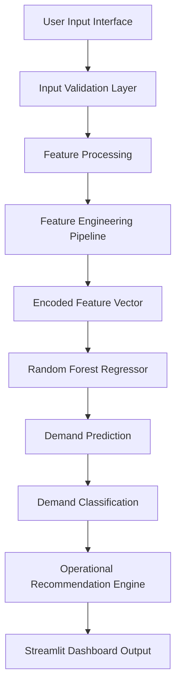
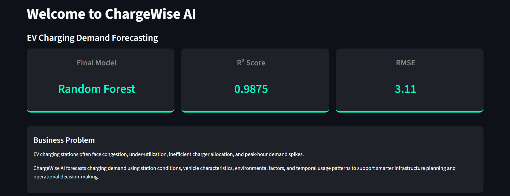
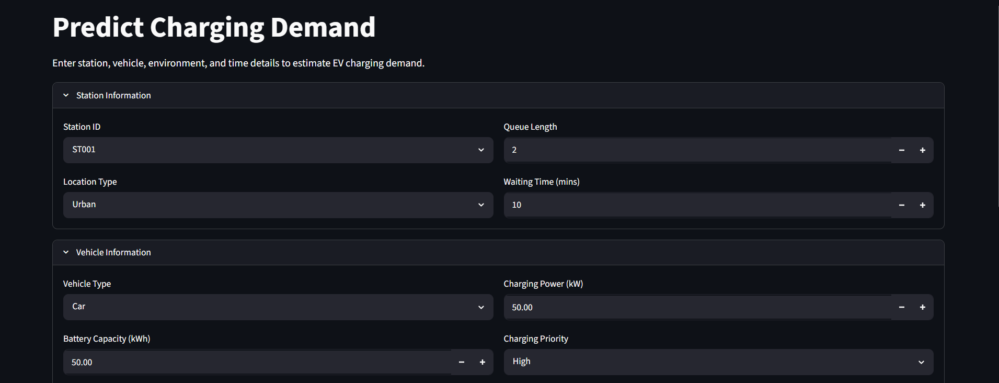
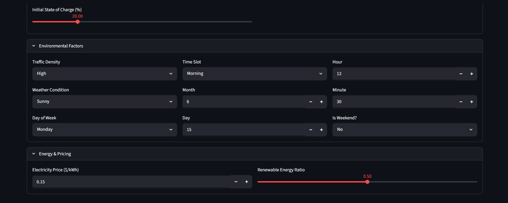
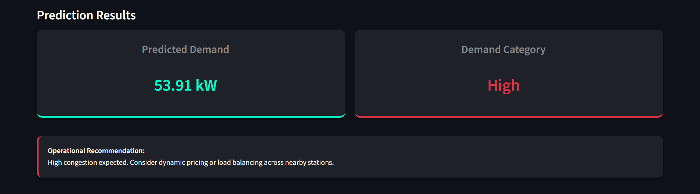
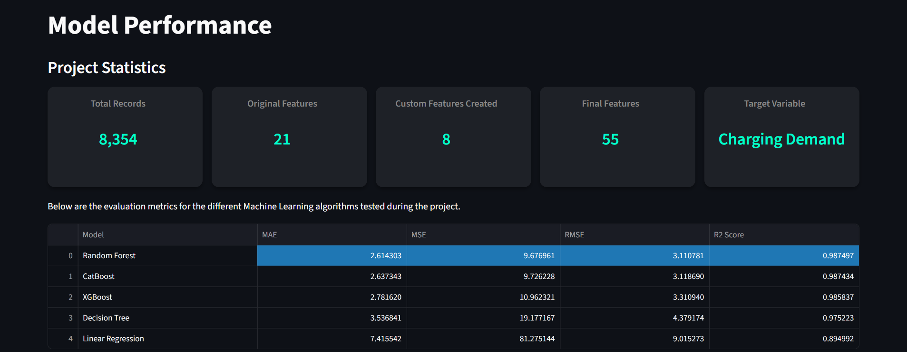

<div align="center">
  <h1>ChargeWise AI</h1>
  <p><strong>AI-Powered EV Charging Demand Forecasting System</strong></p>

  [](https://chargewise-ai.streamlit.app)
  [](https://www.python.org/)
  [](https://scikit-learn.org/)
  [](https://streamlit.io/)
</div>

<br />

## Overview

ChargeWise AI is a machine learning powered forecasting system engineered to predict EV charging demand. By leveraging data-driven decision support, the platform enables intelligent infrastructure planning and operational resource optimization. It accurately models temporal usage patterns, spatial dynamics, and charging conditions to deliver actionable insights for modern EV networks.

## Project Highlights

- End-to-End Machine Learning Pipeline
- 8,354 EV Charging Records
- 55 Final Engineered Features
- 5 Machine Learning Models Evaluated
- Random Forest Selected as Final Model
- R² Score: 0.9875
- RMSE: 3.11
- Interactive Streamlit Dashboard
- Live Cloud Deployment

---

## Live Demo

**Access the deployed application here:** [ChargeWise AI on Streamlit Cloud](https://chargewise-ai.streamlit.app)

**GitHub Repository:** https://github.com/somiya-namdeo/EV-Demand-Forecasting

---

## Dataset & Model Intelligence

### Dataset Profile
- **Total Records:** 8,354
- **Original Features:** 21
- **Custom Features Engineered:** 8
- **Final Features Used:** 55
- **Target Variable:** Charging Demand (kW)

### Machine Learning Models Evaluated
The following algorithms were rigorously evaluated to determine the best predictive capability:
- Linear Regression
- Decision Tree Regressor
- Random Forest Regressor *(Final Selected Model)*
- XGBoost Regressor
- CatBoost Regressor

### Final Model Performance (Random Forest Regressor)
| Metric | Score |
|:---|:---|
| **R² Score** | 0.9875 |
| **RMSE** | 3.11 |
| **MAE** | 2.61 |

---

## Feature Engineering

A robust feature engineering pipeline was implemented to extract deep domain-specific insights:

### Time Features
- Hour, Minute, Month, Day, Day of Week, Weekend Flag
- **Cyclical Encoding:** Hour Sin, Hour Cos

### Geospatial Features
- Geohash Encoding
- Geo Frequency Encoding

### Demand Intelligence Features
- Geo Mean Demand
- Road Mean Demand
- Geo-Time Interaction Features

### Station & Vehicle Features
- Queue Length, Waiting Time
- Charging Power, Battery Capacity, Initial State of Charge

---

## Tech Stack

### Machine Learning & Data Analysis
- **Python** (Core Language)
- **Scikit-Learn** (Random Forest Modeling)
- **XGBoost & CatBoost** (Model Evaluation)
- **Pandas & NumPy** (Data Manipulation)
- **Matplotlib** (Data Visualization)

### Deployment & Tools
- **Streamlit** (Web Application Framework)
- **Streamlit Cloud** (Cloud Deployment)
- **Jupyter Notebook & VS Code** (Development Environments)
- **Git & GitHub** (Version Control)

---

## System Architecture



---
## Business Impact

ChargeWise AI helps EV charging station operators:

- Forecast charging demand before congestion occurs
- Improve charger utilization efficiency
- Support infrastructure expansion planning
- Enable demand-aware operational decisions
- Improve customer charging experience through better resource allocation

---

## Home Dashboard



Overview dashboard showing final model selection and key performance metrics.

---

## Prediction Interface

### Complete Demand Forecasting Workflow

<p align="center">
  
</p>

<br>

<p align="center">
  
</p>

<br>

<p align="center">
  
</p>

Complete demand forecasting interface showcasing station configuration, vehicle characteristics, charging parameters, temporal attributes, environmental conditions, and energy pricing factors used by the Random Forest model to generate EV charging demand predictions.

---

## Prediction Results
## Prediction Results



Predicted charging demand, demand category, and operational recommendation.

---

## Model Performance Dashboard



Comparison of evaluated machine learning models and final model metrics.

---

## Key Features

- **EV Charging Demand Forecasting:** High-accuracy predictive modeling.
- **Interactive Prediction Dashboard:** User-friendly web interface.
- **Automated Demand Categorization:** Intelligent classification (Low, Medium, High).
- **Operational Recommendation Engine:** Actionable business insights based on predictions.
- **Feature Engineering Pipeline:** Custom spatial and temporal features.
- **Multi-Model Comparison:** Evaluated 5 diverse algorithms.
- **Model Performance Analytics:** Transparent metrics and cross-validation tracking.
- **Streamlit Deployment:** Fully integrated production-ready UI.

---

## Local Installation

1. **Clone the repository**
   ```bash
   git clone https://github.com/somiya-namdeo/EV-Demand-Forecasting.git
   cd EV-Demand-Forecasting
   ```

2. **Install dependencies**
   ```bash
   pip install -r requirements.txt
   ```

3. **Run the application**
   ```bash
   streamlit run app.py
   ```

### Accessing the Application
- **Local:** `http://localhost:8501`
- **Deployed Version:** [https://chargewise-ai.streamlit.app](https://chargewise-ai.streamlit.app)

---

## Project Structure

```text
EV-Demand-Forecasting/
├── assets/                  # Images and screenshot assets
├── data/                    # Raw and processed datasets
├── models/                  # Pickled ML models and feature schemas
├── notebook/                # Jupyter notebooks for EDA and training
├── outputs/                 # Exported model evaluation results
├── app.py                   # Main Streamlit application file
├── requirements.txt         # Deployment dependencies
├── runtime.txt              # Python runtime specification
└── README.md                # Project documentation
```

---

## Future Improvements

- Real-Time EV Station Data Integration
- Weather API Integration
- Dynamic Pricing Recommendations
- Demand Heatmaps
- Time-Series Forecasting
- MLOps Pipeline
- Docker Containerization

---

## Author

**Somiya Namdeo**
- B.Tech Computer Science Engineering (AI & ML) @ VIT Bhopal University
- **GitHub:** [@somiya-namdeo](https://github.com/somiya-namdeo)
- **LinkedIn:** [Somiya Namdeo](https://www.linkedin.com/in/somiya-namdeo-/)

